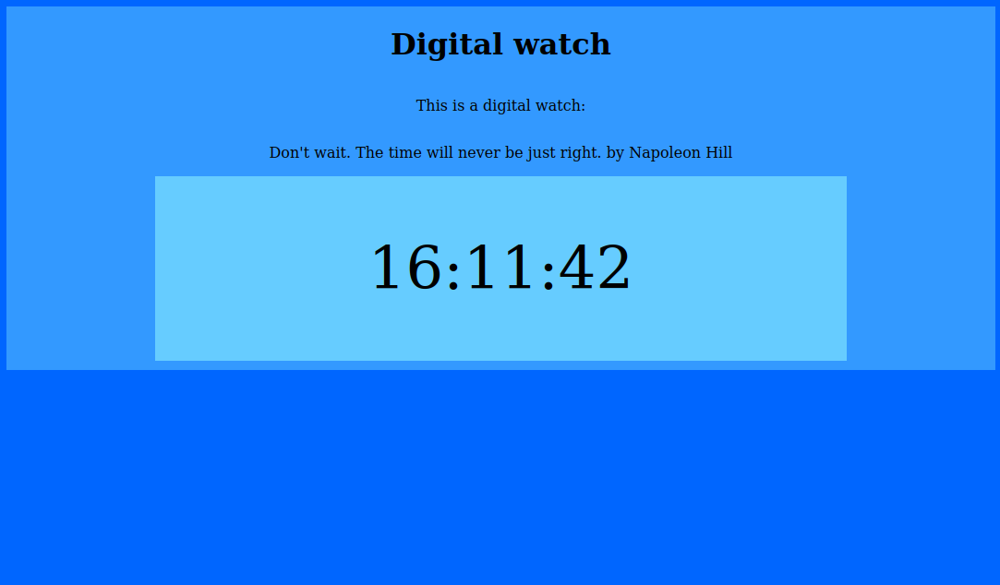

# 0000-digital-watch
**One web page that shows a digital watch.**

This is a small project that will display a ticking digital watch.

To accomplished that I mainly used this features:
- The `Date` browser API
- The `DOM` API
- And the `setInterval()` function

Here is a screenshot of the project:

